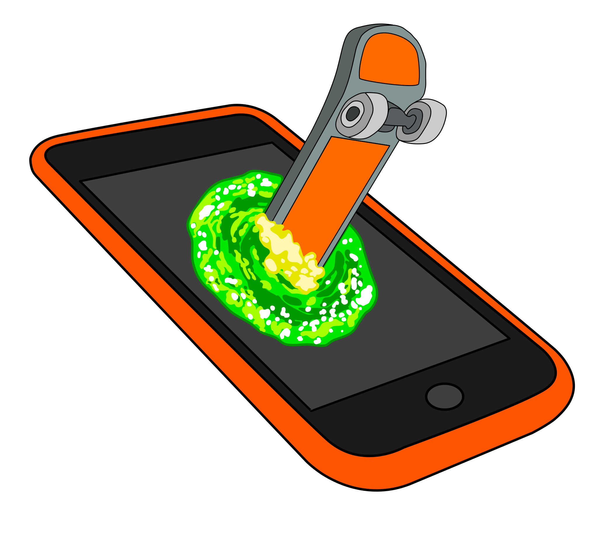

# Skater App

<br/>
<p align="center">
  <a href="https://htl-anichstrasse.tirol">
    
  </a>

  <h3 align="center">SkateBuddy</h3>

  <p align="center">
    A convenient companion for skaters to find new parks and shops.
    <br/>
    <a href="https://github.com/htl-anichstrasse/template/releases">Releases</a>
    ·
    <a href="https://github.com/htl-anichstrasse/template/issues">Report Bug</a>
    ·
    <a href="https://github.com/htl-anichstrasse/template/issues">Request Feature</a>
  </p>
</p>

## About the project

Enter a description about the project, its history and its goals here.

## Installation

Enter a step by step explanation for installing this repository on a local machine.

Clone the repository.

```
git clone https://github.com/htl-anichstrasse/template.git
```

Step 2 here

## Contact

If you have any questions about this project, please feel free to contact us.

Neuner Maximilian - maximilineuner@tsn.at<br>
Schuler Philipp - pschuler@tsn.at<br>
Bertoni Alexander - abertoni@tsn.at<br>
HTL Anichstraße - htlinn@tsn.at

<a href="https://htl-anichstrasse.tirol" target="_blank"></a>
